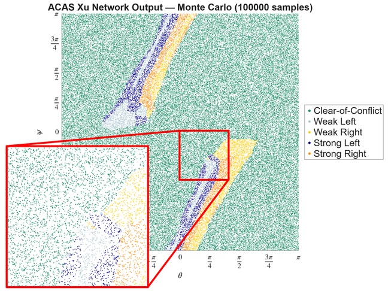
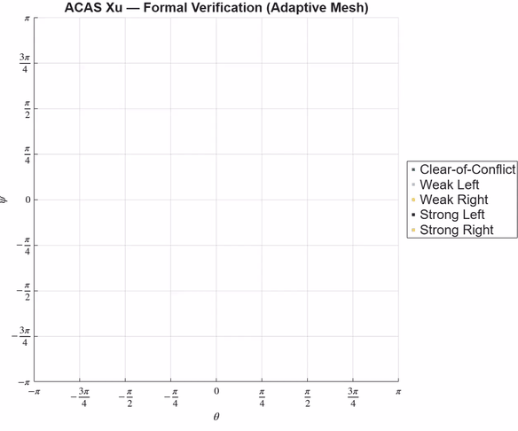

# AI Verification Workshop

**Verifying AI Models Before They Reach the Edge**

At the edge, mistakes are expensive. Once an AI model is optimized, compiled, and connected to real sensors, failures are harder to diagnose. Therefore, it is crucial that AI systems behave as intended, particularly in safety-critical and mission-critical applications.

In this interactive, hands-on workshop, you will learn how to apply AI verification techniques, with a focus on formal methods, to build confidence in neural network behavior before deployment. Using real examples from aerospace applications (ACAS Xu collision avoidance), participants progress from finding adversarial examples to formally verifying global stability across an entire operational design domain.

Learn to move beyond sampling-based testing and gain mathematical verification of neural networks correctness across the entire operational design domain, catching deployment failures that Monte-Carlo approaches miss and getting ahead of emerging safety certification standards.

*Example: The ACAS Xu collision avoidance system compresses a 2GB lookup table into 45 neural networks, reducing memory by over 99%. But how do we know these networks behave correctly in all situations? On the left, Monte-Carlo-based sampling evaluates individual points but cannot guarantee coverage. On the right, formal verification mathematically validates the model across the entire input space.*

| Monte-Carlo-based Sampling | Formal Verification (Adaptive Mesh) |
|:---:|:---:|
|  |  |
| *Monte-Carlo-based sampling leaves gaps in coverage. Zooming in reveals regions where network output is uncertain. With higher-dimensional inputs, these gaps grow larger or require exponentially more simulations to cover the ODD.* | *Formal methods mathematically validate that the network output is correct for ALL possible inputs, without needing to execute tests. The adaptive mesh iteratively verifies the entire ODD, leaving no gaps.* |

## Exercises

| # | Exercise | Description | Results |
|---|----------|-------------|-----------|
| 1 | [Getting Started](Part1_GettingStarted.m) | Generate adversarial examples that fool a digit classifier | [HTML](https://mathworks.github.io/ai-verification-workshop/results/Part1_GettingStarted.html) |
| 2 | [Local Robustness](Part2_LocalRobustness.m) | Formally prove an ACAS Xu network is robust to input perturbations | [HTML](https://mathworks.github.io/ai-verification-workshop/results/Part2_LocalRobustness.html) |
| 3 | [Global Stability](Part3_GlobalStability.m) | Verify stability across the full operational design domain | [HTML](https://mathworks.github.io/ai-verification-workshop/results/Part3_GlobalStability.html) |

## Getting Started

1. Open MATLAB&reg; R2026a or later (or click the "Open in MATLAB Online" badge above)
2. Run `startup.m` to configure paths, verify toolboxes, and download the ACAS Xu dataset
3. Open `Part1_GettingStarted.m` as a Live Script and run section by section

Each exercise is self-contained. Exercises export published HTML results to `results/` when run to completion.

## Required Products

- [MATLAB&reg;](https://www.mathworks.com/products/matlab.html) R2026a or later
- [Deep Learning Toolbox&trade;](https://www.mathworks.com/products/deep-learning.html)
- [AI Verification Library for Deep Learning Toolbox&trade;](https://www.mathworks.com/matlabcentral/fileexchange/ai-verification-library-for-deep-learning-toolbox) (Add-On)

## Optional Products

- [Parallel Computing Toolbox&trade;](https://www.mathworks.com/products/parallel-computing.html) — GPU acceleration for faster verification

## About the Data

- **MNIST Digit Classification Network** — A small CNN trained on handwritten digits (0–9). Ships with Deep Learning Toolbox.
- **ACAS Xu Neural Networks** — 45 fully connected networks from the Airborne Collision Avoidance System for unmanned aircraft. Each network takes 5 inputs (geometry and velocities) and outputs one of 5 steering advisories. Downloaded automatically by `startup.m`.

## References

- [Explore ACAS Xu Neural Networks](https://www.mathworks.com/help/deeplearning/ug/explore-acas-xu-neural-networks.html)
- [Verify Local Robustness of ACAS Xu Neural Networks](https://www.mathworks.com/help/deeplearning/ug/verify-local-robustness-of-acas-xu-neural-networks.html)
- [Verify Global Stability Using Adaptive Mesh](https://www.mathworks.com/help/deeplearning/ug/verify-global-stability-of-acas-xu-neural-networks-using-adaptive-mesh.html)

*Copyright 2026 The MathWorks, Inc.*
